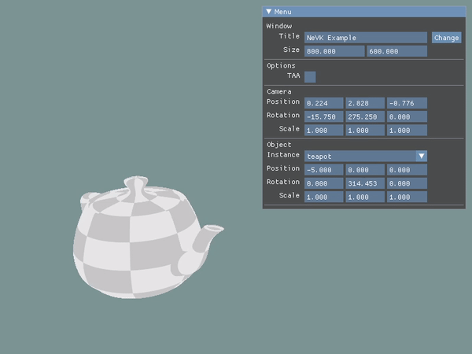
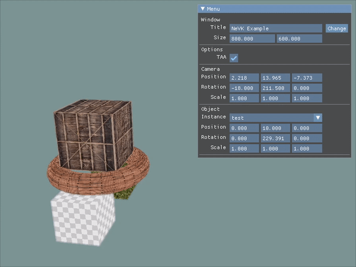
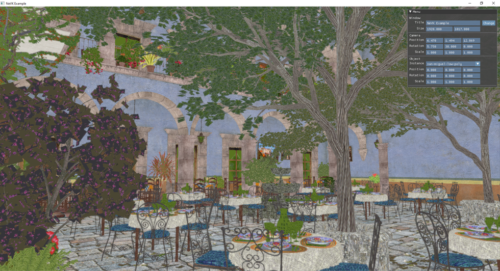

# NeVK | No Error Vulkan

    
    
    
    
    

    
     

## Описание
Целью проекта "No Error Vulkan" (сокр. NeVK) является изучение основ работы с графическим процессором на основе Vulkan API и реализация базовых компонентов видеоигр.

## Минимальные требования
- OS: Windows 10
- Graphics:  NVIDIA GeForce GTX 600, AMD Radeon HD 7700
- Дополнительный софт:
    - Git v2.32
    - CMake v3.19
    - Vulkan SDK v1.2.176
    - Microsoft Visual C++ 2019

## Установка и запуск

1) Загрузка репозитория со всеми зависимостями:  
`git clone --recursive https://github.com/egortrue/NeVK.git`
2) Сборка и компиляция проекта:  
`cd Nevk && mkdir build && cd build`  
`cmake .. && cmake --build .`
3) Запуск приложения:  
`cd bin && nevk.exe`

## Примеры

    
    
Простеший объект

    
    
Составной объект

    
    
Высоконагруженная сцена

